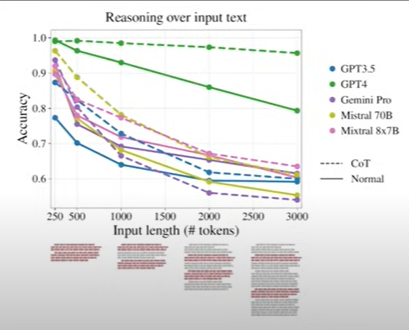

# Prompt Engineering

originally based on https://www.youtube.com/watch?v=CxbHw93oWP0

## Playgrounds and Workbenches

Consumer models are what we are typically familiar with ([chatgpt.com](chatgpt.com), [claude.ai](claude.ai), etc.). These models are optimized for the widest amount of people. What we will learn in this chapter is how to optimzie models to work for yourself.

### https://platform.openai.com/

## Context windows and Prompt Length

Model performance decreases with input length.

Information density!

Eschew obfuscation, espouse elucidation

avoid being unclear; support being clea

word ~ 1.3 tokens

example:

## prompt types

System, user, assitant

## one shot prompts

## conversation engines vs knowledge engines

LLMs are like humans who read a lot. they know roughly stuff but not exact facts. They are conversational.

LLM + knowledge engine are more exact. We can query for facts. (RAG)

## Unambigous language

show video of quantam entanglment 

"produce a report based on this data" - bad prompt
vs
"list the five most populate profucts and write a one paragraph description" (even ebtter, add example)

"Spartan Voice" - Tonality

## Iterate prompts

Range of answers for prompts

Retry prompts and compare 

## output formats

json, xml, markdown, csv, html

## conflicting instructions
"detailed-summary"

## Prompt structure
1. context
2. instructions
3. ouptut format
4. rules
5. examples

## use AI for AI examples

## Use the right model